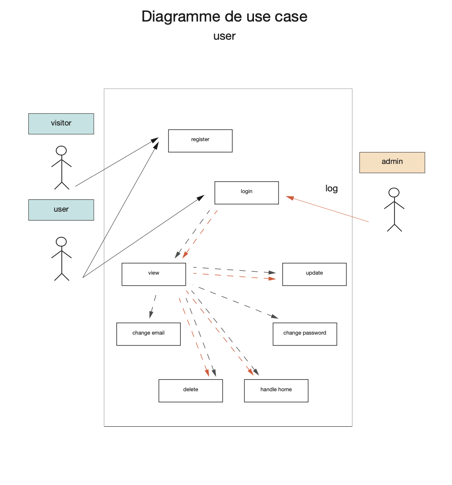
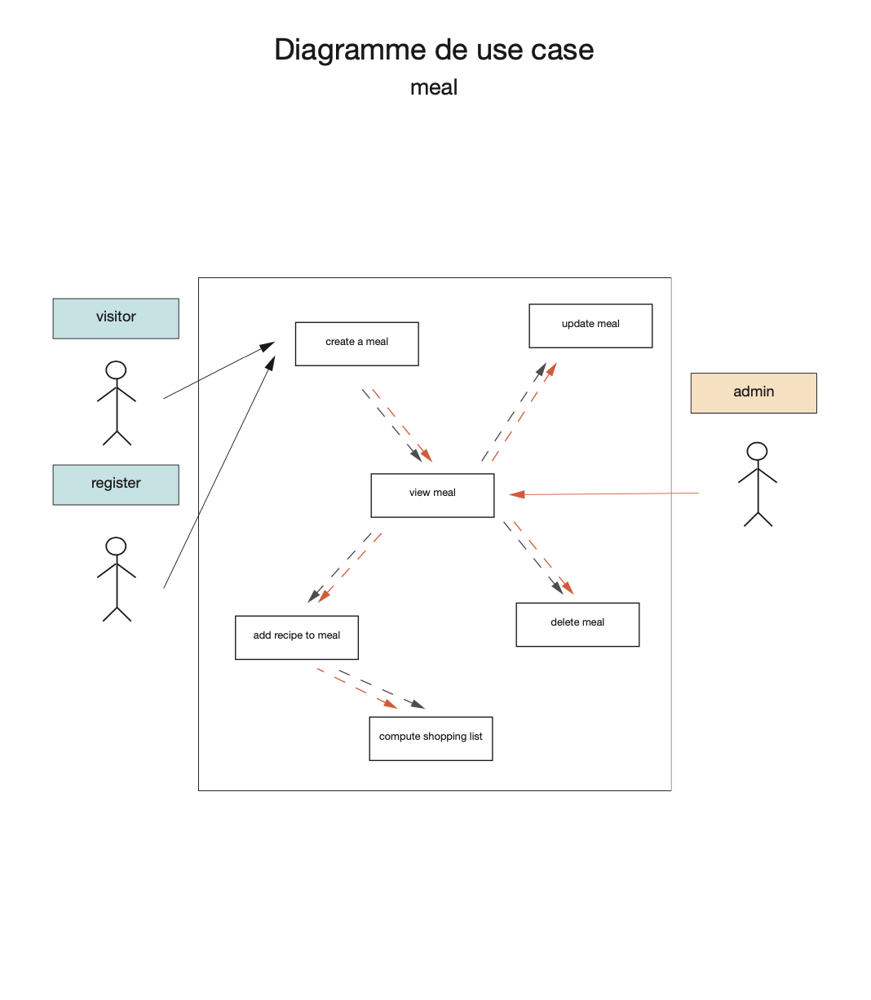
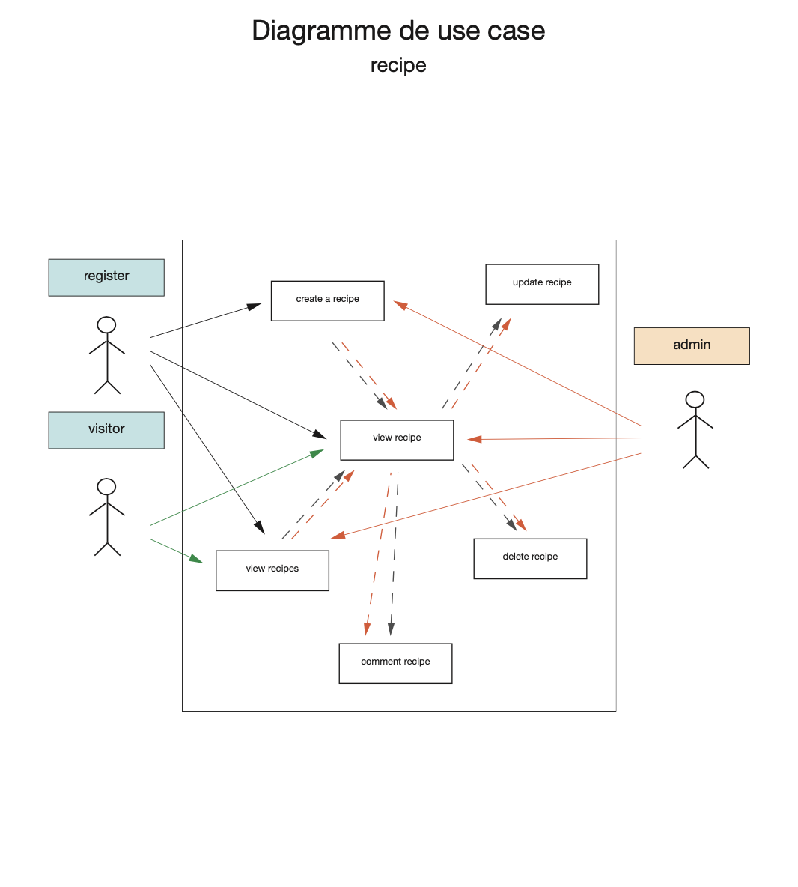
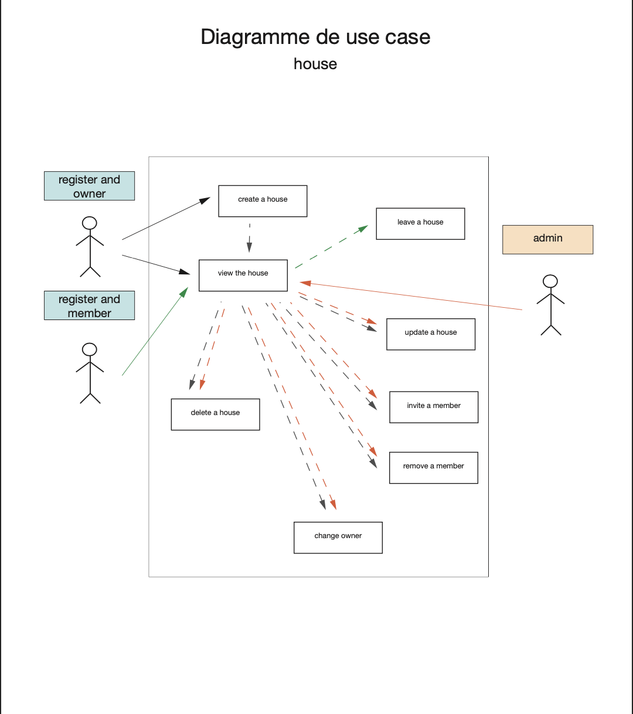
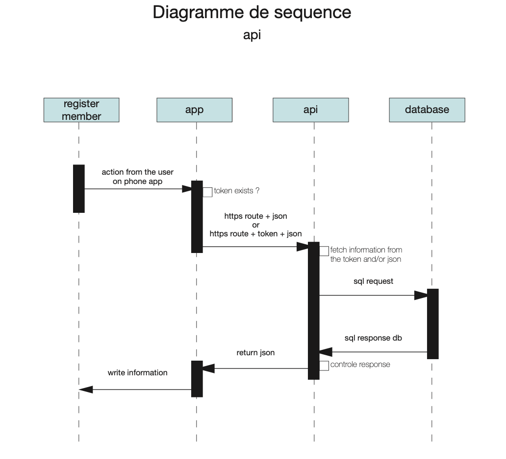
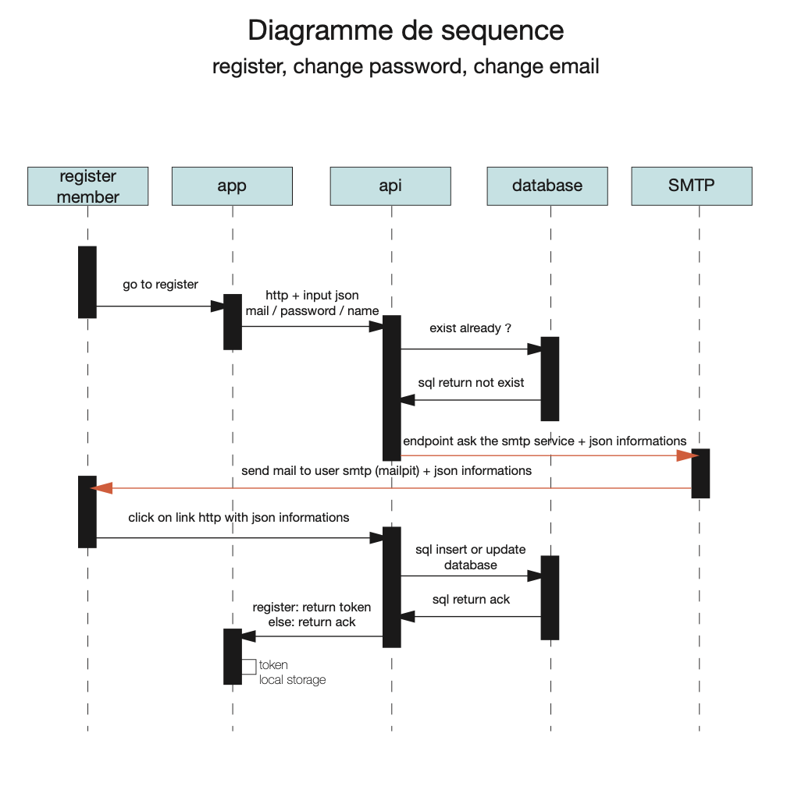
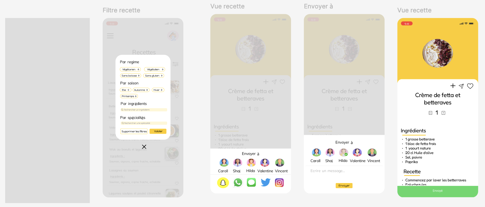
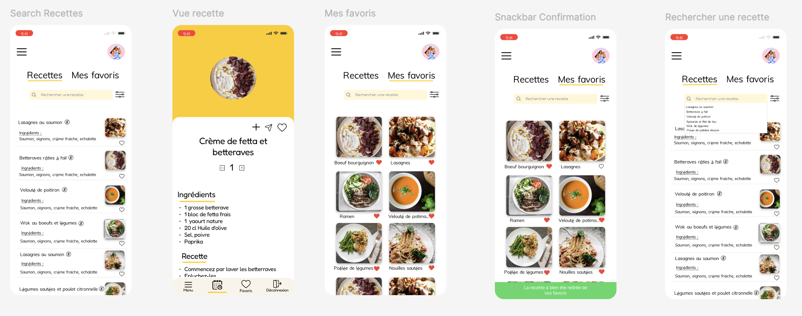
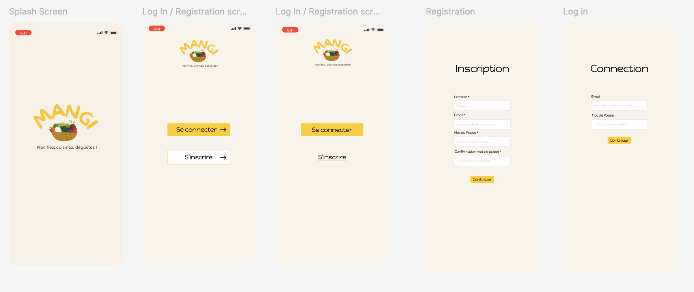

# **Mangi**

Liste de courses et + si affinités...

## **Intro**

In today’s digital age, managing daily life and time effectively has become a significant challenge for many people. Tasks such as grocery shopping and weekly meal planning often require careful organization, involving the creation of shopping lists and the selection of appropriate recipes. 

As such, having a practical and efficient tool to simplify these tasks is becoming increasingly important. The trend of meal planning, or "meal prep," has gained substantial popularity on social media platforms, offering a structured approach to saving time and effort. However, for many, the process of organizing weekly meals can still be a daunting challenge. The need to coordinate shopping lists, find recipe ideas, and arrange meals for the week can quickly turn into an overwhelming task. This highlights the growing demand for a solution that can streamline these responsibilities. In response to this, we aim to propose a practical and efficient tool that simplifies meal planning and grocery management, helping users navigate these everyday tasks with greater ease and convenience.

## **Contents**

- [Prerequisites](https://rendu-git.etna-alternance.net/module-9681/activity-52182/group-1038068#prerequisites)
- [Installation guide](https://rendu-git.etna-alternance.net/module-9681/activity-52182/group-1038068#installation-guide)
- [User manual](https://rendu-git.etna-alternance.net/module-9681/activity-52182/group-1038068#user-manual)
- [Crew](https://rendu-git.etna-alternance.net/module-9681/activity-52182/group-1038068#crew)

## **Prerequisites**

### backend
- Golang
- mysql
- mailpit
- bruno [see the bruno folder](https://rendu-git.etna-alternance.net/module-9681/activity-52182/group-1038068/-/tree/KAN-82_updating-readme/Mangi_bruno)
### frontend
- react / TS
- Expo
- React
- npm
### Deployment
- Docker
- Jenkins

## **Architecture**

### **Usecase diagram**

Here is an overview of the usecases diagrams of mangi    





***

### **Folder architecture**

Here is an overview of the folder architecture for mangi    



***

### **Design**





## **Installation guide**

**DEVELOPEMENT**

### Api
From root's folder in your terminal run    
`make api && bin/api`  
The instance of localhost:8080 is your api's binary default runing  
Open a new terminal's window to check the endpoints as in the user manual.

### App
From app's folder in your terminal run    
`npx expo start`   
The instance of localhost:8081 is your app's binary default runing   
Use application expo to run on your smartphone   

### Mailpit
In your terminal run    
`mailpit`   
The instance of localhost:8025 is your mails's UI runing   
The smtp protocol is runing on localhost:1025   

### Mysql
From root's folder in your terminal run    
`mysql -u username -p `   
The instance of localhost:3306 is your db's runing    

### Bruno
git pull will give you the folder Mangi_bruno    
Import you folder in bruno, you'll have all routes of the api    

### Deployment 

**local**
Run the docker image        
`docker-compose up --build`   
`docker-compose up`   
To destroy    
`docker-compose down`   

**Deployment**

Go to wm-staging.mangi.local    
run your jenkins build to build the release    
check on portainer.mangi.local to check if your build on staging is completed   

## **User manual**

documentation on [MET3](https://rendu-git.etna-alternance.net/module-9680/activity-52183/group-1038670)

## **R&D usefull informations**

### build and run the api
You can add flags on running bin.   
use the following flag for dsn like:   
```--dsn user:password@tcp(127.0.0.1:3306)/dbName?parseTime=true```
use the following flag for address like:   
```--addr 127.0.0.1:8080```
use the following flag for secret key of JWT like:   
```--secretKey "put your secret key"```   

### build and seed the database
You can build the database and seed it with the schema and seed files   
```mysql - u username -p (if password) < db/schema.sql```     
```mysql - u username -p (if password) < db/seed.sql```

### run the integration tests
You can build the database and seed it with the schema and seed files   
```bru run --env <your env> --tests-only```     
Each test is the bruno test part of the route.   

### staging
After deployment done on jenkins   
vm-staging.mangi.local     
Run you app with    
```npx expo start```   
And configure your app with     
```export const client = new Client("http://staging.mangi.local");```    

### production
This is the exposed mangi application    
Run you app with    
```npx expo start```   
And configure your app with     
```export const client = new Client("http://production.mangi.local");```    

## **Crew**

- Valentine B. : architecture infra / engineer devops / database
- Caroll K. : architecture dev / engineer backend / database
- Shaïnez B. : engineer front End / design / product owner
- Vincent P. : engineer front end
- Hilda B. : engineer front end / design
